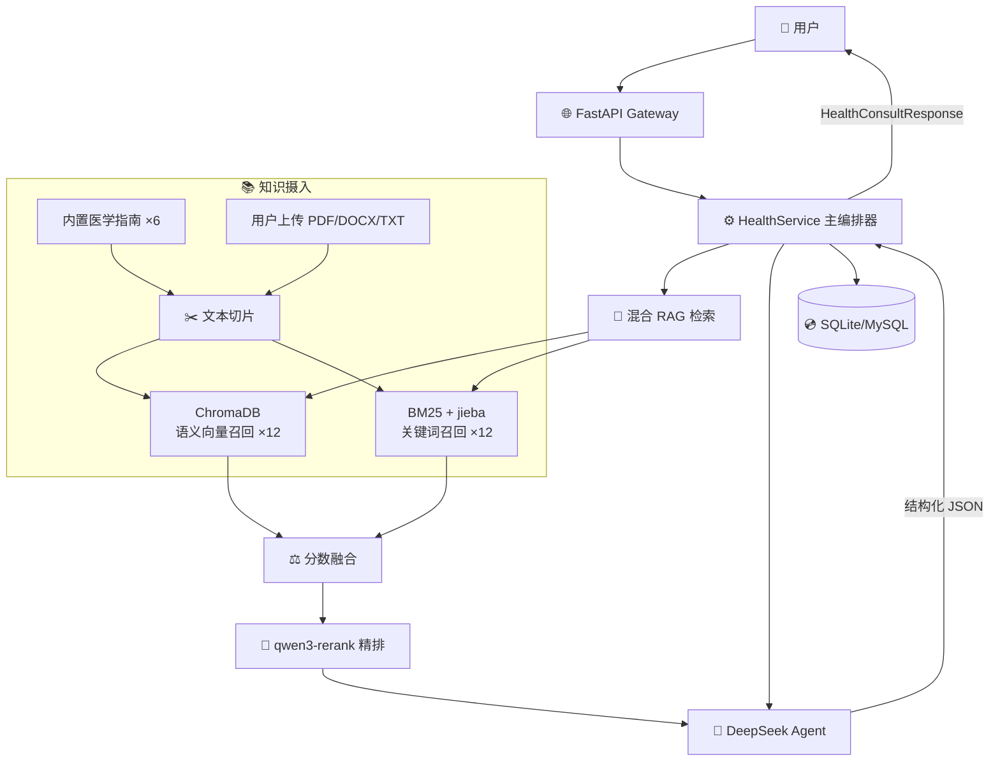

# 🏥 MediPrepAgent

> 智能就诊准备助手 — 健康科普 + 科室推荐，不做诊断。

[](https://www.python.org/)
[](https://fastapi.tiangolo.com/)
[](https://www.langchain.com/)
[](https://platform.deepseek.com/)
[](LICENSE)

---

## 📖 简介

**MediPrepAgent** 帮助用户在就诊前做好充分准备。输入症状描述，即可获得：

- 🏥 **科室推荐** — 应该挂哪个科？为什么？
- 📚 **健康科普** — 可能的相关因素和医学知识解释
- ⚠️ **风险提示** — LOW / MEDIUM / HIGH 三级风险提醒
- ✅ **就诊清单** — 就诊前需要准备什么（资料、检查、问题清单）
- 💡 **生活建议** — 日常注意事项

> ⚠️ **重要声明**：本系统仅用于健康科普和就诊准备，**不能替代医生诊断**。如症状严重或持续加重，请及时线下就医。

---

## 🏗️ 系统架构



### 核心流程

```
用户输入症状
    → (可选) 合并历史上下文
    → RAG 混合检索（向量 + BM25 + Rerank）
    → DeepSeek Agent 推理（System Prompt + Safety Tool + 中间件）
    → 结构化 JSON 输出（summary / causes / risk / department / checklist）
    → 保存上下文
    → 返回给用户
```

---

## 🛠️ 技术栈

| 层级 | 技术 | 说明 |
|:---|:---|:---|
| **Web 框架** | FastAPI + Uvicorn | 异步 REST API，自动生成 Swagger 文档 |
| **配置管理** | pydantic-settings | `.env` 集中管理，类型安全 |
| **ORM** | SQLAlchemy 2.0 (async) | 异步数据库，SQLite(开发)/MySQL(生产) |
| **向量数据库** | ChromaDB | 语义向量存储与检索 |
| **Embedding** | `BAAI/bge-small-zh-v1.5` | 中文文本向量化，CPU 本地推理 |
| **关键词检索** | BM25Okapi + jieba | 中文分词 + BM25 统计算法 |
| **重排序** | DashScope `qwen3-rerank` | Cross-encoder 精排，深度语义匹配 |
| **LLM** | DeepSeek `deepseek-chat` | 主力推理大模型，兼容 OpenAI 协议 |
| **Agent 框架** | LangChain + LangGraph | ReAct 智能体，对话记忆，中间件 |

### RAG 检索管线（三级架构）

```
第一级：双路并行召回
  ├── ChromaDB 语义召回 (top_k=12)
  └── BM25 关键词召回 (top_k=12)

第二级：分数融合 + 候选截断
  └── hybrid_score = 0.55×vector + 0.45×bm25 → top 20

第三级：Cross-Encoder 精排
  └── DashScope qwen3-rerank → final top_k=5
  └── 降级：API 不可用时回退到 hybrid_score
```

---

## 🚀 快速开始

### 前置要求

- Python 3.10+
- Git

### 1. 克隆项目

```bash
git clone https://github.com/your-username/MediPrepAgent.git
cd MediPrepAgent/backend
```

### 2. 创建虚拟环境

```bash
python -m venv venv

# Windows
venv\Scripts\activate

# macOS/Linux
source venv/bin/activate
```

### 3. 安装依赖

```bash
pip install -r requirements.txt
```

### 4. 配置环境变量

在 `backend/` 目录下创建 `.env` 文件：

```env
# LLM 配置（必填）
LLM_API_KEY=your_deepseek_api_key
LLM_BASE_URL=https://api.deepseek.com
LLM_MODEL=deepseek-chat


# DashScope Rerank API Key（可选，不填则降级到 hybrid_score）
DASHSCOPE_API_KEY=your_dashscope_api_key
```

### 5. 初始化知识库

```bash
# 将内置医学指南灌入 ChromaDB 和 BM25 索引
python scripts/ingest_medical_docs.py
```

### 6. 启动服务

```bash
uvicorn app.api.main:app --reload --host 0.0.0.0 --port 8000
```

访问 http://localhost:8000/docs 查看 Swagger API 文档。（仅供开发者，暂未开通体验服务）

---

## 📡 API 接口

### 核心接口

| 方法 | 路径 | 说明 |
|:---|:---|:---|
| `POST` | `/health/consult` | **健康咨询**（核心） |
| `POST` | `/api/knowledge/upload` | 上传知识文件 |
| `POST` | `/api/knowledge/upload/batch` | 批量上传知识文件 |
| `POST` | `/api/knowledge/search` | 搜索知识库 |

### 咨询示例

```bash
curl -X POST http://localhost:8000/health/consult \
  -H "Content-Type: application/json" \
  -d '{
    "symptoms": "头痛三天，太阳穴跳痛，没有恶心呕吐",
    "age": 28,
    "gender": "男",
    "duration": "3天",
    "goal": "想知道挂什么科，就诊前需要准备什么"
  }'
```

```json
{
  "summary": "根据你描述的单侧太阳穴跳痛、无恶心呕吐...",
  "possible_causes": ["紧张性头痛", "偏头痛早期", "用眼疲劳"],
  "risk_result": {
    "risk_level": "LOW",
    "warnings": ["如出现剧烈头痛、呕吐、视力模糊请立即就医"],
    "action": "建议预约神经内科门诊评估"
  },
  "department_result": {
    "primary_department": "神经内科",
    "alternative_departments": ["疼痛科", "眼科"],
    "reason": "头痛是神经系统常见主诉，神经内科为首诊科室"
  },
  "pre_visit_checklist": [
    "记录头痛频率、持续时间、加重/缓解因素",
    "记录是否伴随恶心、畏光、视力变化",
    "携带既往检查报告"
  ],
  "lifestyle_advice": [
    "保持规律作息，避免熬夜",
    "减少咖啡因和酒精摄入",
    "头痛加重及时就医"
  ],
  "references": ["headache.md"],
  "disclaimer": "本结果仅用于健康科普和就诊准备，不能替代医生诊断..."
}
```

---

## 📁 项目结构

```
MediPrepAgent/
└── backend/
    ├── app/
    │   ├── config.py                 # 全局配置（pydantic-settings）
    │   ├── api/
    │   │   ├── main.py               # FastAPI 入口 & 生命周期
    │   │   └── routes/
    │   │       ├── health.py         # /health/consult 核心路由
    │   │       ├── knowledge.py      # 知识库上传/搜索
    │   │       ├── department.py     # 科室推荐（遗留）
    │   │       ├── risk.py           # 风险检测（遗留）
    │   │       └── record/report/export.py  # 预留
    │   ├── agents/
    │   │   ├── health_agent.py       # DeepSeek LangChain Agent
    │   │   └── tools/
    │   │       └── rag_tool.py       # RAG 工具封装
    │   ├── rag/
    │   │   ├── document_loader.py    # PDF/DOCX/TXT 加载
    │   │   ├── chunker.py            # 文本切片
    │   │   ├── vector_db.py          # ChromaDB 存储 & 检索
    │   │   ├── bm25_store.py         # BM25 JSONL 索引
    │   │   ├── hybrid_retriever.py   # 混合检索 + 分数融合
    │   │   └── dashscope_reranker.py # qwen3-rerank 精排
    │   ├── models/
    │   │   ├── db_models.py          # SQLAlchemy ORM
    │   │   └── schemas.py            # Pydantic 请求/响应
    │   └── services/
    │       ├── health_service.py     # 主编排器（核心业务）
    │       ├── knowledge_service.py  # 知识库管理
    │       ├── health_context_service.py  # 会话上下文
    │       ├── department_service.py # 规则引擎（已弃用）
    │       └── risk_service.py       # 规则引擎（已弃用）
    ├── data/
    │   ├── medical_guides/           # 内置医学指南 ×6
    │   ├── chroma_db/                # ChromaDB 持久化
    │   ├── rag_chunks.jsonl          # BM25 索引
    │   └── uploads/knowledge/        # 用户上传文件
    ├── scripts/
    │   └── ingest_medical_docs.py    # 离线知识库初始化
    ├── requirements.txt
    └── .env
```

---

## 🔒 安全设计

### 五条红线

1. 不能做疾病确诊
2. 不能替代医生诊疗
3. 不能推荐处方药、剂量或治疗方案
4. 只能做健康科普、风险提示、科室导航和就诊准备
5. 用户明确否认的症状（如"没有胸痛"），不得当作阳性高危信号

### 实现机制

| 机制 | 作用 |
|:---|:---|
| **System Prompt 硬约束** | Agent 每次推理受上述红线约束 |
| **Safety Tool** | LangChain `@tool`，推理前返回安全边界声明 |
| **输出 Schema 约束** | 所有输出为结构化 JSON，防止自由文本不当内容 |
| **四级降级策略** | Rerank API → hybrid_score；JSON parse → fallback_output |
| **来源可追溯** | RAG 结果附带引用来源文件 |

---

## 🧪 内置医学指南

| 文件 | 内容 |
|:---|:---|
| `headache.md` | 头痛：因素、警惕情况、科室、准备 |
| `chest_pain.md` | 胸痛：因素、高危信号、科室 |
| `cough.md` | 咳嗽：因素、警惕、科室、建议 |
| `insomnia.md` | 失眠：相关因素与就诊建议 |
| `anxiety.md` | 焦虑：相关因素与就诊建议 |
| `stomach_pain.md` | 胃痛：相关因素与就诊建议 |

可通过上传接口扩展知识库，支持 PDF、DOCX、TXT、Markdown 格式。

---

## 🗺️ 路线图

- [x] 核心健康咨询 Agent
- [x] 混合 RAG 检索（向量 + BM25 + Rerank）
- [x] 知识库上传 & 双写存储
- [x] 会话上下文记忆（多轮对话）
- [ ] Web 前端界面
- [ ] Redis 缓存层
- [ ] 检查报告解读
- [ ] 健康档案管理
- [ ] Docker 一键部署

---

## 📄 License

MIT © 2025
